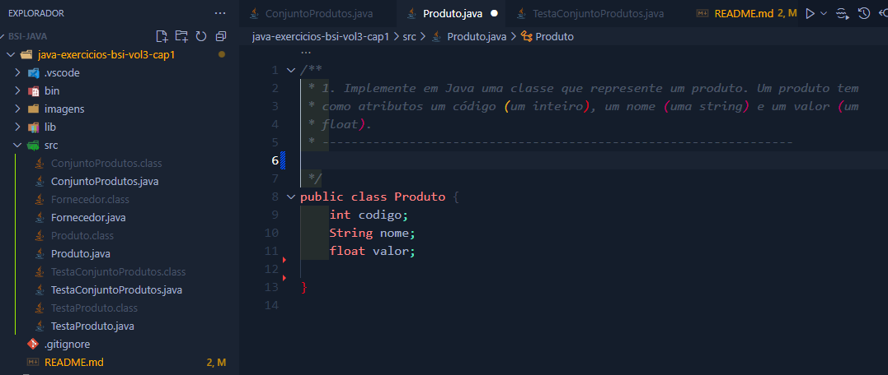
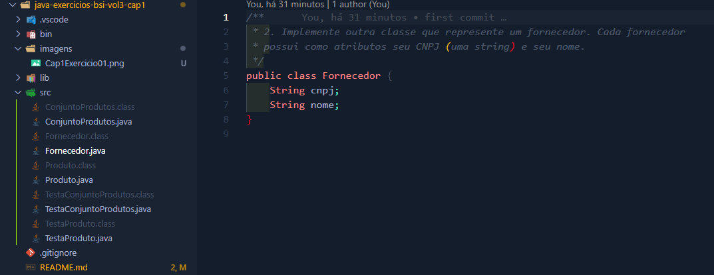
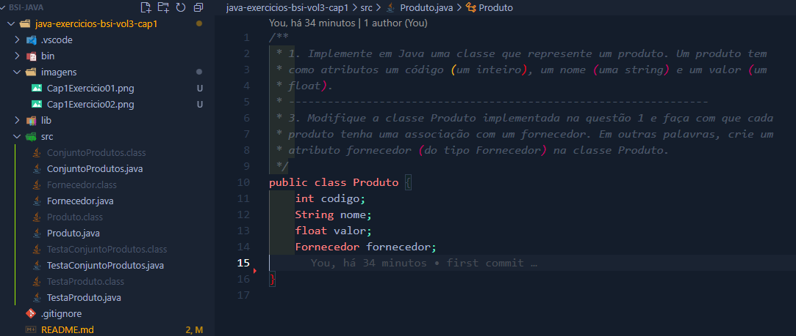
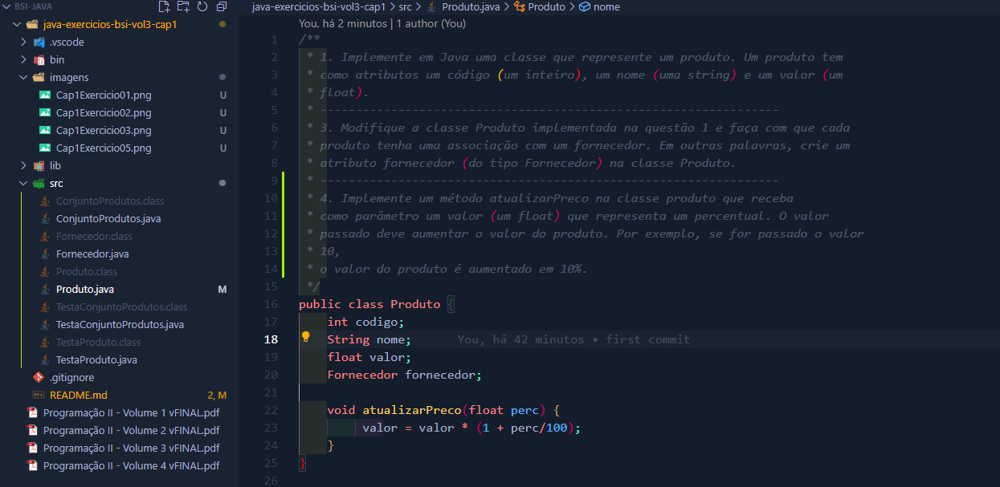
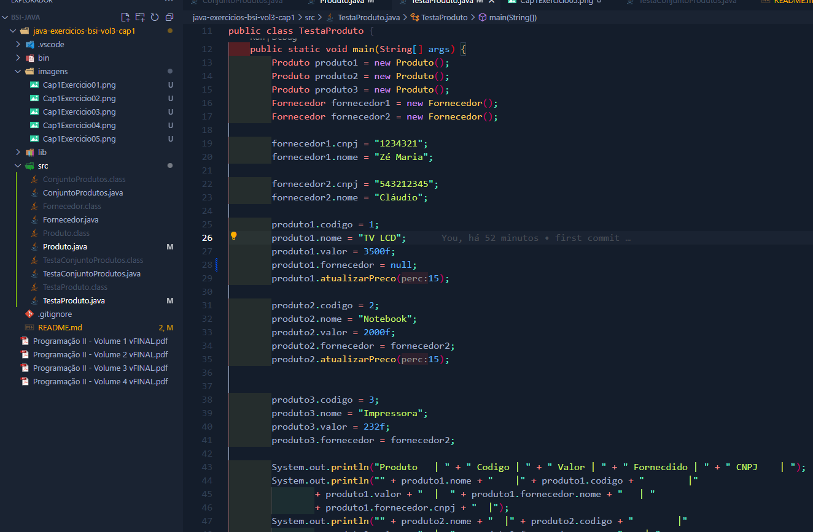
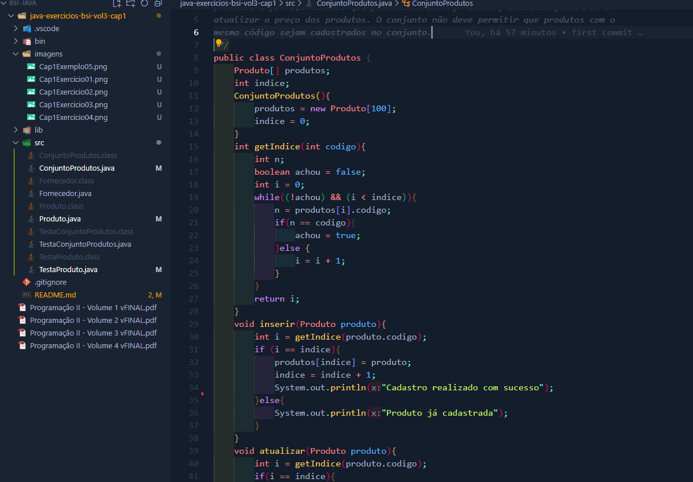
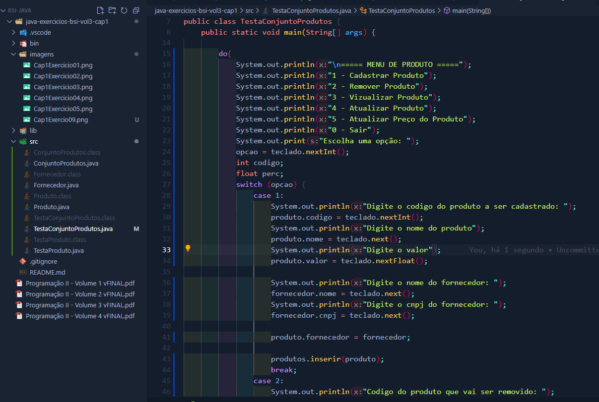

# Programação II - Exercícios Capítulo 3 (Volume 2) - UFRPE EAD

**"Este projeto reúne os exercícios do Capítulo 1 (Objetos em Java) do Volume 3 da apostila da disciplina de Programação II, do curso de Bacharelado em Sistemas de Informação (EAD) da UFRPE.

O material didático, escrito por Fernando Trinta, publicado pela UFRPE, explora a aplicação prática da Programação Orientada a Objetos com Java. Os exercícios foram implementados em um único projeto, com o objetivo de aplicar e fixar os conceitos estudados no capítulo, como a implementação de classes e objetos, o uso de construtores, encapsulamento e a sobrecarga de métodos."**

## Estrutura do Projeto

- `TesteProduto.java`: Para vizualizar o cadastro de produtos com informações fixa no codigo.
- `TestaConjuntoProdutos.java`: Com um menu onde é posivel escolher entre, cadatrar, atualizar, remover e atualizar o preço dos produtos.

## Exercícios

### Exercício 01

**Descrição:** 1. Implemente em Java uma classe que represente um produto. Um produto tem como atributos um código (um inteiro), um nome (uma string) e um valor (um float).

**Resultado:**



---

### Exercício 02

**Descrição:** 2. Implemente outra classe que represente um fornecedor. Cada fornecedor possui como atributos seu CNPJ (uma string) e seu nome.

**Resultado:**



---

### Exercício 03

**Descrição:** Modifique a classe Produto implementada na questão 1 e faça com que cada produto tenha uma associação com um fornecedor. Em outras palavras, crie um
atributo fornecedor (do tipo Fornecedor) na classe Produto.

**Resultado:**



---

### Exercício 04

**Descrição:** Implemente um método atualizarPreco na classe produto que receba
como parâmetro um valor (um float) que representa um percentual. O valor
passado deve aumentar o valor do produto.

**Resultado:**



---

### Exercício 05, 06, 07

**Descrição:** Crie uma classe TesteProduto. No método main desta classe, instancie três produtos e dois fornecedores.
Modifique a classe TesteProduto e conceda um aumento de 15% nos dois
produtos. Utilize o método atualizarPreco para esta operação.
Modifique a classe TesteProduto e após a criação do produto1, faça com que
o fornecedor deste produto seja uma referência nula.

**Resultado:**



---

### Exercício 08

**Descrição:** De acordo com a modificação da questão anterior, explique quais seriam os objetos
que poderiam ser capturados pelo coletor de lixo e devolvidos como área livre para
o sistema? Explique sua resposta.

**Resultado:**

Verificar o arquivo exercicio08.txt

---

### Exercício 09 e 10

**Descrição:** Crie uma classe chamada ConjuntoProdutos que contenha um array que possa guardar até 100
produtos e forneça métodos que permitam inserir, remover, atualizar, mostrar e atualizar o preço dos produtos. O conjunto não deve permitir que produtos com o mesmo código sejam cadastrados no conjunto.

Baseado na classe Programa, crie uma classe TestaConjuntoProdutos que permita que o usuário use o teclado para utilizar todos os recursos da classe
ConjuntoProdutos.

**Resultado:**





---

## Como baixar e executar o projeto

### 1. Clonar o repositório

No terminal, execute:

```sh
git clone https://github.com/lipeqalves/java-exercicios-bsi-vol3-cap1.git
```

Depois, acesse a pasta do projeto:

```sh
cd java-exercicios-ufrpe-vol3-cap1
```

### 2. Compilar e executar o App.java

Entre na pasta `src`:

```sh
cd src
```

Compile e Execute o programa:

```sh
javac TestaProduto.java
```

```sh
java TestaProduto
```

Assim, vai ser posivel testar vizualizar o cadastro de um unico produto.

```sh
javac TestaConjuntoProdutos.java
```

```sh
java TestaConjuntoProdutos
```

dessa forma teremos o exemplos para cadastrar, excluir, atualizar e atualizar preço de varios produtos.

#### Exemplo do menu exibido

```text
===== MENU DE EXERCÍCIOS =====
1 - Cadastrar Produto
2 - Remover Produto
3 - Vizualizar Produto
4 - Atualizar Produto
5 - Atualizar Preço do Produto
0 - Sair
Escolha uma opção:
```

---

Projeto desenvolvido para fins acadêmicos - UFRPE EAD
